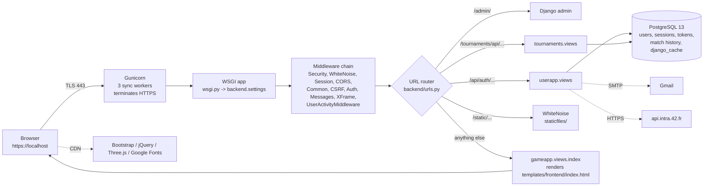

# 00 — Overview: FAST_PONG (ft_transcendence)

> **Why this matters at the evaluation.** Staff will open with "what is this project and how does it run?" and then drill into any layer. This file gives you the 5-minute mental model: what the product is, what the stack is, how a request travels, and where every other answer lives in this guide. Read it first, then the architecture files, then the module deep-dives.

## What the app is

FAST_PONG is our 42 Abu Dhabi ft_transcendence capstone: a single-page web app where a registered user plays **3D Pong** (Three.js) against another person on the same keyboard or against an AI, (with a **Player-vs-Player** mode or an **AI opponent**), sees match history and a **stats dashboard** on a profile (plus a bonus TicTacToe mini-game that is *not* a claimed module), manages friends, runs local **round-robin tournaments** with tiebreakers, logs in with **email/password + optional email 2FA** or with **42 OAuth**, and exercises **GDPR rights** (export, delete). Branding in the UI is "FAST_PONG"; the repo/compose project is named `basta`.

## The stack (as deployed by `docker-compose.yml`)

| Layer | What we actually use | Where |
|---|---|---|
| Backend framework | Django 4.2 (`requirements.txt` pins `Django>=4.2,<5.0`) with Django REST Framework 3.14 and `djangorestframework-simplejwt` | `backend/`, `userapp/`, `gameapp/`, `tournaments/` |
| Database | PostgreSQL 13 (`db` service), driver `psycopg2-binary` | `docker-compose.yml`, `backend/settings.py:88-97` |
| App server / TLS | **Gunicorn, 3 sync workers, terminating HTTPS itself on port 443** with the self-signed `localhost.pem` / `localhost-key.pem` — there is no nginx and nothing listens on port 80 | `scripts/entrypoint.sh:56-66` |
| Static files | WhiteNoise `CompressedManifestStaticFilesStorage` serving `staticfiles/` (hashed filenames) | `backend/settings.py:75,311` |
| Frontend | One Django template (`templates/frontend/index.html`) rendered server-side, then a vanilla-JS SPA (`static/frontend/js/script.js`) with client-side routing; Bootstrap 4.5 CSS/JS, jQuery slim, Popper and Three.js r128 from CDNs; Google Fonts | `templates/frontend/index.html:10-14,599-611` |
| 3D graphics | Three.js (WebGL) in `static/frontend/js/pong.js` | see `SPA-routing-and-frontend.md` |
| Auth | Django session (`login()`), JWT access/refresh (simplejwt) returned as JSON and stored in `localStorage`, DRF `Token` created on 2FA login, 42 OAuth authorization-code flow, email OTP 2FA | `userapp/views.py` |
| Email | Django `send_mail` over Gmail SMTP (`transcendance.2fa@gmail.com`) | `backend/settings.py:220-231` |
| Config | `python-decouple` reads `.env` **once at process start** — after editing `.env` you must `make down && make up` (or `docker-compose up -d --force-recreate web`) | `backend/settings.py:13` |

**🆕 Changed in Aug-2026 audit:** `EMAIL_BACKEND`, `EMAIL_TIMEOUT` (default 10 s) and `OTP_TTL_SECONDS` (default 600) are now read from `.env` (`backend/settings.py:223-225,303`), and a shared **DatabaseCache** (`django_cache` table) replaced the per-process default cache (`backend/settings.py:296-301`).

## How to run it

```bash
make build      # docker-compose build
make up         # docker-compose up -d  -> https://localhost  (accept the self-signed cert)
make logs       # follow container logs (note: Gunicorn stdout goes to gunicorn-error.log, see below)
make test       # docker-compose exec web python manage.py test   (57 tests, all green)
make migrate    # apply migrations inside the container
make shell      # Django shell
make down       # stop
make clean      # stop AND delete the postgres volume (destroys data)
make gdpr-cleanup      # 🆕 dry-run of delete_inactive_users
make gdpr-cleanup-run  # 🆕 really delete users inactive > 6 months
```

Things to know before a demo:

* The first start runs `makemigrations`, `migrate`, `createcachetable` and `collectstatic` automatically (`scripts/entrypoint.sh:45-52`).
* Gunicorn is started with `--capture-output --error-logfile /app/gunicorn-error.log`, so **all `print()` output and Django logging land in `gunicorn-error.log` in the repo root** (bind-mounted), not in `docker logs`.
* **🆕 Demo trick when Gmail is unavailable:** add `EMAIL_BACKEND=django.core.mail.backends.console.EmailBackend` to `.env`, restart, and the OTP email is printed into `gunicorn-error.log` (`grep "OTP for login" gunicorn-error.log`).
* `make test` previously crashed with `ImproperlyConfigured: SECRET_KEY must not be empty`; **🆕** `docker-compose.yml` now sets `DJANGO_SETTINGS_MODULE=backend.settings` for `exec` commands and `production_settings.py` falls back to the `.env` key.

### `.env` keys the code reads

| Key | Used by |
|---|---|
| `DJANGO_SECRET_KEY`, `DEBUG`, `ALLOWED_HOSTS` | `backend/settings.py:27-32` — also signs simplejwt tokens and sessions |
| `DB_NAME/DB_USER/DB_PASSWORD/DB_HOST/DB_PORT` | `backend/settings.py:88-97` |
| `EMAIL_HOST/PORT/USE_TLS/HOST_USER/HOST_PASSWORD`, `DEFAULT_FROM_EMAIL`, 🆕 `EMAIL_BACKEND`, 🆕 `EMAIL_TIMEOUT` | 2FA and GDPR emails |
| `JWT_SECRET_KEY`, `JWT_EXP_DELTA_SECONDS`, `JWT_ALGORITHM`, `CLIENT_ID`, `CLIENT_SECRET`, `REDIRECT_URI` | `JWT_SETTINGS` dict (`backend/settings.py:234`) — only used by the dead `jwt_required` decorator / `check_auth` |
| `FORTYTWO_CLIENT_ID`, `FORTYTWO_CLIENT_SECRET`, `FORTYTWO_REDIRECT_URI` (= `https://localhost/oauth/callback`) | 42 OAuth (`userapp/views.py:481-512, 586-671`) |
| `CORS_*`, `CSRF_*` | `backend/settings.py:190-219` |
| 🆕 `OTP_TTL_SECONDS` | 2FA code lifetime |

## Repository layout

| Path | Purpose |
|---|---|
| `backend/` | Django project: `settings.py`, `urls.py` (root router), `wsgi.py`, `asgi.py` |
| `userapp/` | Custom `User` model, auth (login/register/logout/2FA/OAuth), profile, friends, match history, GDPR (export/anonymize/delete, `delete_inactive_users` command), activity middleware, password validator, **tests** |
| `gameapp/` | SPA host view with SSR context (`index`), online TicTacToe matchmaking (`TicTacToeQueue`/`TicTacToeMatch`, `/api/game/ttt/*`), tests |
| `tournaments/` | `Tournament/Player/Match` models, round-robin + tiebreaker logic, JSON API, tests |
| `templates/frontend/index.html` | The single server-rendered page containing every SPA "page" `<div>` |
| `static/frontend/` | `css/styles.css`, `js/script.js` (router + all API calls), `js/pong.js` (3D game incl. `PongAI`), `js/tictactoe.js` (bonus mini-game), `assets/man.png` (default avatar) |
| `staticfiles/` | `collectstatic` output (committed; **never edit by hand**) |
| `scripts/entrypoint.sh` | Container start sequence (used); `scripts/init_db.sh` (unused, daphne-based) |
| `docker-compose.yml`, `Dockerfile`, `Makefile` | Two services: `web`, `db` |
| `production_settings.py`, `wsgi.py`, `wsgi_utils.py`, `check_wsgi.py` | Deployment helpers (mostly unused — see `architecture/01-system-and-containers.md`) |
| `gdpr_cleanup_crontab` | Cron line for the GDPR command (not installed in the image) |
| `localhost.pem`, `localhost-key.pem` | Self-signed TLS cert used by Gunicorn |
| `docs/` | This guide, the audit report, the final report |
| `presentation/index.html` | Slide deck for the evaluation |

## Top-level request flow



Key facts to say out loud:

1. **Every non-API URL returns the same `index.html`** (`backend/urls.py:16`, `re_path(r'^.*$', index)`), so a deep link like `/profile` or `/oauth/callback?code=…` loads the SPA, which then reads `window.location.pathname` and shows the right `<div>`.
2. The API is split in two prefixes: `/api/auth/…` (userapp) and `/tournaments/api/tournaments/…` (tournaments).
3. State lives in PostgreSQL only — no Redis, no message broker, no Celery. **🆕** The 2FA code also lives in PostgreSQL now (`django_cache` table) so that all 3 Gunicorn workers see it.
4. TLS is terminated by Gunicorn itself; the app therefore runs with `DEBUG=False` and WhiteNoise serves static files.

## Selected modules (the list the evaluation is scored against)

| # | Module | Weight | Deep dive |
|---|---|---|---|
| 1 | Web — use a framework as backend (Django) | Major | `modules/01-web-django-backend.md` |
| 2 | Web — front-end framework or toolkit (Bootstrap) | Minor | `modules/02-web-frontend-bootstrap.md` |
| 3 | Web — database for the backend (PostgreSQL) | Minor | `modules/03-web-postgresql.md` |
| 4 | User Management — standard user management, authentication, users across tournaments | Major | `modules/04-user-management.md` |
| 5 | User Management — remote authentication (42 OAuth) | Major | `modules/05-remote-authentication-42-oauth.md` |
| 5b | Gameplay & UX — add another game with user history and **matchmaking** (TicTacToe, local + online) | Major | `modules/12-another-game-matchmaking.md` |
| 6 | AI-Algo — introduce an AI opponent | Major | `modules/06-ai-opponent.md` |
| 7 | AI-Algo — user and game stats dashboards | Minor | `modules/07-stats-dashboards.md` |
| 8 | Cybersecurity — GDPR compliance: anonymization, local data management, account deletion | Minor | `modules/08-cybersecurity-gdpr.md` |
| 9 | Cybersecurity — 2FA and JWT | Major | `modules/09-cybersecurity-2fa-jwt.md` |
| 10 | Graphics — advanced 3D techniques (Three.js) | Major | `modules/10-graphics-3d.md` |
| 11 | Accessibility — expanding browser compatibility · SSR integration | 2 × Minor | `modules/11-accessibility.md` |

7 Major + 6 Minor = 10 major-equivalents (7 are needed for 100 %). **Not** selected — do not claim them: support on all devices (the responsive layout and Pong touch controls exist, but are not a claimed module), microservices, multiple languages, live chat, remote players, blockchain.

## How to use this study guide

| File | Read it to answer |
|---|---|
| `architecture/01-system-and-containers.md` | "Draw your deployment", "what does the entrypoint do", "why 3 workers", "what is this unused file" |
| `architecture/02-backend-apps.md` | "Which app does X", "list your endpoints", "which endpoints are protected and how" |
| `architecture/03-database-er.md` | "Show me your schema", "why is email the username field", "what cascades on delete" |
| `architecture/04-request-lifecycle.md` | "Walk me through one request", "how does CSRF work with your SPA", "why collectstatic" |
| `architecture/05-sequence-diagrams.md` | Login, OAuth, 2FA, game→history, tournament, GDPR — step by step |
| `SPA-routing-and-frontend.md` | Router, games, Three.js scene, AI opponent, stats dashboard rendering, tokens, avatars |
| `modules/01-web-django-backend.md` … `11-accessibility.md` | One file per selected module with evaluator Q&A (see list below) |
| `quick-drill.md` | 30+ rapid-fire questions |
| `../audit-report.md` | Everything found/fixed/deferred in Aug-2026, with severities |
| `../FINAL-REPORT.md` | What changed, what the humans still have to do |
