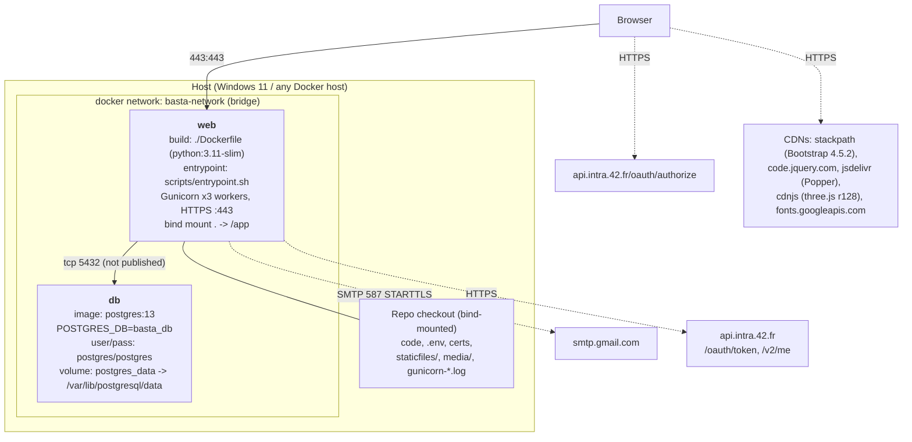

# 01 — System & container architecture

> **Why this matters at the evaluation.** The DevOps module claims a "backend designed as microservices". Staff will ask you to draw the deployment and explain each box. You must be able to say exactly what runs where, what the container does at boot, and be honest about what is *not* a separate service. This file is also where the 2FA bug story starts (3 Gunicorn workers).

## Container diagram

Facts (`docker-compose.yml`):

* Only **two services**: `web` and `db`. Only `web` publishes a port (`443:443`). `db` is reachable solely on the internal bridge network as hostname `db`.
* `web` mounts the whole repo at `/app` (plus the two cert files explicitly). Consequence: code edits are live after a Gunicorn restart, `collectstatic` output and Gunicorn logs are written back into the repo directory, and `media/` uploads persist on the host.
* Environment for `web`: `DATABASE_URL` (unused by settings), `DEBUG=0`, `DJANGO_ALLOWED_HOSTS`, `PYTHONPATH=/app`, and **🆕 `DJANGO_SETTINGS_MODULE=backend.settings`** (was `production_settings`, which broke every `docker-compose exec … manage.py` command — see `docs/audit-report.md`).
* `depends_on: db` only orders startup; the entrypoint itself waits for port 5432.
* The Dockerfile's own `ENTRYPOINT/CMD` (`scripts/init_db.sh`, daphne) are **overridden** by compose's `entrypoint: ["/bin/bash", "/app/scripts/entrypoint.sh"]`.

## What `scripts/entrypoint.sh` does at boot (in order)

| Step | Lines | What / why |
|---|---|---|
| 1. Wait for Postgres | `scripts/entrypoint.sh:4-7` | `nc -z db 5432` loop — avoids migrating before the DB accepts connections |
| 2. Detect settings module | `:22-41` | Looks for `settings.py` at root, then `basta/`, then any top-level dir → finds `backend/settings.py` → exports `DJANGO_SETTINGS_MODULE=backend.settings` |
| 3. `makemigrations` | `:45` | Generates migrations for model changes (unusual in prod, but it is how the team worked) |
| 4. `migrate` | `:46` | Applies migrations |
| 5. 🆕 `createcachetable` | `:47-48` | Creates the `django_cache` table backing the shared 2FA OTP store (no-op if it exists) |
| 6. 🆕 `collectstatic --noinput` | `:50-52` | Regenerates `staticfiles/` + manifest. Previously commented out ("causing issues"), which left the served `script.js` stale relative to `static/` |
| 7. Gunicorn | `:56-66` | `--bind 0.0.0.0:443 --workers 3 --certfile=localhost.pem --keyfile=localhost-key.pem --log-level debug --error-logfile /app/gunicorn-error.log --access-logfile /app/gunicorn-access.log --capture-output --pythonpath /app --env DJANGO_SETTINGS_MODULE=… wsgi:application` |

`wsgi:application` is the **root-level `wsgi.py`**, which re-detects the settings module the same way and calls `get_wsgi_application()`. (`backend/wsgi.py` is the stock Django one and is not what Gunicorn loads.)

`--capture-output` means every `print()` in the views (there are many) and Python logging go to `gunicorn-error.log`. That is where the 2FA OTP appears when using the console email backend.

## Why "3 workers" mattered (the 2FA bug)

Gunicorn's `sync` worker model forks **3 independent Python processes**; each request is handed to whichever worker is free. Django's default cache (`LocMemCache`, used when no `CACHES` setting exists) is a dictionary **inside one process**. The OTP was written by the worker that served `POST /api/auth/login/` and read by the worker that served `POST /api/auth/verify-otp/` — a different process about 2/3 of the time → `cache.get()` returned `None` → "Invalid OTP". Reproduced during the audit by running `cache.set` in one process and `cache.get` in a spawned second process inside the container (`worker A sets 123456 → worker B reads None`), and by watching worker PIDs in `gunicorn-error.log`.

**🆕 Changed in Aug-2026 audit:** `CACHES` now uses `django.core.cache.backends.db.DatabaseCache` with `LOCATION='django_cache'` (`backend/settings.py:296-301`). All workers share PostgreSQL, so all workers see the code. Verified live: 5/5 login→verify rounds succeeded including rounds served by different PIDs.

A second effect of sync workers: while a worker waited on Gmail SMTP during login (up to ~2 s, or forever without a timeout), it could serve nothing else. **🆕** The OTP mail is now sent from a daemon thread (`userapp/views.py:46-70`) with `EMAIL_TIMEOUT=10`.

## Where TLS/certs come from

`localhost.pem` / `localhost-key.pem` are self-signed (mkcert-style) certificates committed to the repo. Gunicorn loads them directly (`--certfile/--keyfile`). Browsers show a warning once; `curl` needs `-k`. There is no HTTP→HTTPS redirect because nothing listens on 80.

## Unused / legacy files — know them so you are not surprised

| File | Status | Honest explanation |
|---|---|---|
| `production_settings.py` | Not loaded by the running server | Wrapper that star-imports `backend.settings` then adds `SECURE_SSL_REDIRECT`, HSTS, etc. It was the compose `DJANGO_SETTINGS_MODULE` for `exec` commands only. 🆕 `SECRET_KEY = os.environ.get('SECRET_KEY') or SECRET_KEY` so it no longer crashes if someone selects it. |
| `wsgi.py` (repo root) | **Used** by Gunicorn | Detects the settings module and builds the WSGI app |
| `backend/wsgi.py`, `backend/asgi.py` | Unused | Stock Django files; ASGI would only matter with daphne/channels, which we do not run |
| `wsgi_utils.py`, `check_wsgi.py` | Unused diagnostics | `check_wsgi.py` tries to import `basta.wsgi`, a module that does not exist — leftover from an earlier layout |
| `scripts/init_db.sh` | Unused | Dockerfile default entrypoint (daphne + `backend.asgi`) overridden by compose |
| `gdpr_cleanup_crontab` | Not installed | The image has no cron daemon. 🆕 `make gdpr-cleanup(-run)` runs the command manually |
| `django_otp`, `otp_totp` apps | Installed, unused | 2FA is our own email-OTP implementation; django-otp tables exist but nothing writes to them |
| `gameapp` models `Game/Player/Score` | Migrated, unused | Frontend uses `userapp.MatchHistory` instead |
| `sendgrid-django`, `Werkzeug`, `pyOpenSSL`, `daphne` in `requirements.txt` | Installed, unused at runtime | `runserver_plus` (django-extensions + Werkzeug) only in the unused `init_db.sh` dev path |

## Is this "microservices"? (say this honestly)

The runtime is **one Django process group + one PostgreSQL service**. The backend is *modular* — three Django apps with clear boundaries (`userapp` = identity & GDPR, `tournaments` = tournament engine, `gameapp` = SPA host), each with its own models/urls/tests, communicating only through the ORM/DB — but they are deployed as a single container and share one database. Do not call the Django apps "microservices" if pressed; call it a **modular monolith with containerised services (web, db)** and explain how it *would* split (see `modules/devops-microservices.md` and the presentation's Limitations slide).
