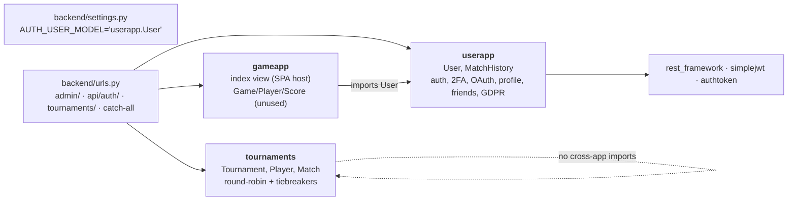

# 02 — Backend apps and the full URL map

> **Why this matters at the evaluation.** "Which app handles X?", "list your endpoints", "how is this endpoint protected?" are guaranteed questions. The auth story is subtle here (session cookie vs JWT vs DRF Token) — know the table below cold, because the honest answer is "it depends on the decorator".

## The Django project and its apps

Dependency facts: `gameapp/models.py:3` imports `userapp.models.User`; `tournaments` imports nothing from the other apps (tournament players are plain nicknames, not `User` rows); `userapp` depends on DRF, simplejwt and `rest_framework.authtoken`.

### `userapp` — identity, auth, profile, GDPR

| Component | Contents |
|---|---|
| Models (`userapp/models.py`) | `User(AbstractUser)` `:6-63` — `USERNAME_FIELD='email'`, `friends` M2M; `MatchHistory` `:66-90` |
| Views (`userapp/views.py`) | `send_otp_email_async` `:46` (🆕 helper), `profile_view` `:76`, `update_profile` `:207` (not routed), `login_view` `:239`, `verify_otp` `:293`, `register_view` `:364`, `logout_view` `:465`, `check_auth` `:470`, `redirect_uri` `:481`, `oauth_callback` `:515`, `get_token` `:586`, `verify_otp_view` `:674` (not routed), `user_settings_view` `:702`, `match_history_view` `:746`, `save_match_view` `:775`, `create_match` `:826`, `anonymize_account` `:851` (🆕), `delete_account` `:891`, `get_avatar_image` `:901`, `debug_avatar_path` `:939`, `export_user_data` `:972`, `get_all_users` `:1033`, `get_friends` `:1063`, `add_friend` `:1088`, `remove_friend` `:1119` |
| URLs | `userapp/urls.py` (mounted at `/api/auth/`) — also mounts simplejwt's `TokenObtainPairView` and `TokenRefreshView` |
| Middleware | `userapp/middleware.py` `UserActivityMiddleware` — after each response, if the user is authenticated and `last_activity` is older than `LAST_ACTIVITY_UPDATE_WINDOW` (15 min) it calls `user.update_last_activity()` (`:10-29`). Feeds the GDPR inactivity cleanup. |
| Validators | `userapp/validators.py` `PasswordStrengthValidator` — ≥1 uppercase, ≥1 special char, ≥1 digit; registered in `AUTH_PASSWORD_VALIDATORS` together with min length **10**, common-password and numeric checks (`backend/settings.py:107-130`) |
| Utils | `userapp/utils.py` `jwt_required` — decodes a PyJWT token signed with `JWT_SETTINGS['JWT_SECRET_KEY']`. **Dead**: simplejwt signs with `SECRET_KEY`, so every real token fails here |
| Management command | `userapp/management/commands/delete_inactive_users.py` — `--dry-run`, `--notify-only`; warns at 5 months, deletes at 6 |
| Admin | `userapp/admin.py` registers `User` with the stock `UserAdmin` |
| Tests | `userapp/tests.py` — 🆕 `TwoFactorLoginTests` (10), `NoTwoFactorLoginTests` (1), `GdprTests` (5) |
| Migrations | `0001`…`0007` (display_name, MatchHistory, friends, last_activity/last_warned_date) |

### `tournaments` — local round-robin engine

| Component | Contents |
|---|---|
| Models (`tournaments/models.py`) | `Tournament` `:7-86` with `get_status()` `:12`, `get_winner()` `:18` (creates tiebreakers lazily), `create_additional_matches()` `:67`, `is_complete()` `:83`; `Player` `:88-100` (`unique_together (tournament, nickname)`, `get_score()` = number of matches won); `Match` `:102-128` |
| Views (`tournaments/views.py`) | `create_tournament` `:22`, `add_players` `:41` (creates all `combinations(players, 2)` matches), `view_tournament` `:74` (calls `get_winner()` → this is the side-effect that creates tiebreaker matches), `start_match` `:120`, `get_match_details` `:149`, `finish_match` `:165`, `update_match_state` `:197` (accepts and ignores state) |
| URLs | `tournaments/urls.py` mounted at `/tournaments/` → all under `/tournaments/api/tournaments/…` |
| Forms | `tournaments/forms.py` — `TournamentForm`, `PlayerForm` (unused by the SPA) |
| Tests | `tournaments/tests.py` — 3 tests (🆕 corrected to call `get_winner()`; they previously always failed) |
| Comments | Written in Russian — the author (Nour) wrote the docstrings; they describe exactly what the views do |

### `gameapp` — SPA host

| Component | Contents |
|---|---|
| View | `gameapp/views.py:4` `index` → `render(request, 'frontend/index.html')`; mounted as the catch-all in `backend/urls.py:16` |
| URLs | `gameapp/urls.py` — empty list (`app_name='gameapp'`), not included anywhere |
| Models | `Game`, `Player`(OneToOne User), `Score` — migrated, registered in admin, **not used by any view or JS** |
| Tests | `gameapp/tests.py` — empty |

### `backend` — project

* `settings.py` — see `04-request-lifecycle.md` for middleware and `00-overview.md` for env keys. Note `INSTALLED_APPS` includes `django_otp`, `django_otp.plugins.otp_totp`, `rest_framework.authtoken`, `django_extensions`, `whitenoise.runserver_nostatic` (`backend/settings.py:37-54`).
* `urls.py` — four rules: `admin/`, `api/auth/` → userapp, `tournaments/` → tournaments, `re_path(r'^.*$', index)` catch-all; `+ static(MEDIA_URL…)` which is a no-op when `DEBUG=False` (avatars are therefore served by `get_avatar_image`, not `/media/`).

## Full URL table (what is enforced, really)

Authentication legend — **Session**: Django session cookie set by `login()`; **JWT**: `Authorization: Bearer <simplejwt access>` accepted by DRF's default `JWTAuthentication`; **Token**: DRF `Token <key>` (created only in `verify_otp`); **CSRF**: Django `CsrfViewMiddleware` requires `X-CSRFToken` on unsafe methods unless the view is `@csrf_exempt` (DRF's `SessionAuthentication` re-enforces CSRF when a session authenticates the request).

| Method | Path | View | Auth actually enforced | Notes |
|---|---|---|---|---|
| POST | `/api/auth/login/` | `login_view` | none (credentials in body); CSRF | Returns `requires_2fa` or access+refresh JWT; also creates a session |
| POST | `/api/auth/verify-otp/` | `verify_otp` | none; CSRF | 🆕 tolerant compare, returns `refresh_token` too |
| GET/POST | `/api/auth/register/` | `register_view` | none; `@ensure_csrf_cookie` | GET is used by the SPA to obtain the `csrftoken` cookie |
| POST | `/api/auth/logout/` | `logout_view` | none required; CSRF | Only clears the session; JWT stays valid until expiry (frontend deletes it from localStorage) |
| GET | `/api/auth/check-auth/` | `check_auth` | `jwt_required` (dead) | Always 401 with real tokens; not called by the SPA |
| POST | `/api/auth/redirect_uri/` | `redirect_uri` | `@csrf_exempt` | Builds the 42 authorize URL |
| GET | `/api/auth/oauth_callback/` | `oauth_callback` | `@csrf_exempt` | **Unused** (42 redirects to the SPA route `/oauth/callback`); sets `jwt_token`/`refresh_token` cookies if it were used |
| POST | `/api/auth/get-token/` | `get_token` | `@csrf_exempt` | Exchanges the 42 `code`, logs in, returns JWTs |
| POST | `/api/auth/token/` | simplejwt `TokenObtainPairView` | credentials (`email`+`password`) | Not used by the SPA |
| POST | `/api/auth/token/refresh/` | simplejwt `TokenRefreshView` | refresh token in body | 🆕 SPA URL corrected to this path |
| GET/PUT | `/api/auth/profile/` | `profile_view` | **Session or Token only** (`@authentication_classes([TokenAuthentication, SessionAuthentication])`) + `IsAuthenticated`; CSRF on PUT | The SPA sends a Bearer header *and* the session cookie — the cookie is what authenticates here |
| GET/PUT | `/api/auth/settings/` | `user_settings_view` | Session or Token only | Same caveat; not used by the SPA |
| GET | `/api/auth/match-history/` | `match_history_view` | JWT / Token / Session / Basic (DRF defaults) | Last 10 matches |
| POST | `/api/auth/save-match/`, `/api/auth/match/save` | `save_match_view` | DRF defaults; `@csrf_exempt` | Creates `MatchHistory` |
| POST | `/api/auth/match/create/` | `create_match` | DRF defaults; `@csrf_exempt` | Returns a UUID `match_id` (TicTacToe) |
| POST | `/api/auth/anonymize-account/` 🆕 | `anonymize_account` | DRF defaults; CSRF if session-authenticated | Strips PII, disables login, keeps stats |
| DELETE | `/api/auth/delete-account/` | `delete_account` | DRF defaults | Hard delete, cascades `MatchHistory` |
| GET | `/api/auth/avatar/<id>/` | `get_avatar_image` | none | Streams the file or `assets/man.png` |
| GET | `/api/auth/debug-avatar/<id>/` | `debug_avatar_path` | none | Debug helper, leaks `MEDIA_ROOT` path |
| GET | `/api/auth/export-data/` | `export_user_data` | DRF defaults | GDPR export JSON |
| GET | `/api/auth/users/` | `get_all_users` | DRF defaults | All users except self and superusers |
| GET | `/api/auth/friends/` | `get_friends` | DRF defaults | |
| POST | `/api/auth/friends/add/<id>/`, `/remove/<id>/` | `add_friend`, `remove_friend` | DRF defaults | |
| POST | `/tournaments/api/tournaments/create/` | `create_tournament` | **none** (CSRF only) | Anyone with a CSRF cookie can create tournaments |
| POST | `/tournaments/api/tournaments/<id>/add_players/` | `add_players` | none (CSRF) | |
| GET | `/tournaments/api/tournaments/<id>/` | `view_tournament` | none | Side effect: may create tiebreaker matches |
| POST | `/tournaments/api/tournaments/match/<id>/start/` | `start_match` | none (`@csrf_protect`) | |
| POST | `/tournaments/api/tournaments/<id>/finish/` | `finish_match` | none (CSRF) | |
| GET | `/tournaments/api/tournaments/<id>/details/` | `get_match_details` | none | |
| POST | `/tournaments/api/tournaments/match/<id>/state/` | `update_match_state` | none (CSRF) | No-op |
| GET | `/admin/` | Django admin | superuser session | |
| GET | anything else | `gameapp.views.index` | none | Serves the SPA |

### Talking points on auth

* **Three mechanisms coexist.** `login()` always creates a Django session; simplejwt access/refresh tokens are returned as JSON and kept in `localStorage`; the DRF `Token` is created only on 2FA login (`userapp/views.py:327-328`) and the SPA sends `Token <jwt>` (wrong scheme with a JWT value) only on tournament calls, which do not check auth anyway.
* **Where the JWT is actually validated:** every `@api_view` without an explicit `authentication_classes` — match history, save-match, friends, users, export, anonymize, delete — via `REST_FRAMEWORK['DEFAULT_AUTHENTICATION_CLASSES']` (`backend/settings.py:56-63`). Verified during the audit with curl + Bearer only (no cookies): 201/200 on those, 401 on `/profile/`.
* **Where the session cookie is what works:** `profile_view` and `user_settings_view`.
* `SIMPLE_JWT` (`backend/settings.py:65-71`): access 60 min, refresh 7 days, rotation on, blacklist-after-rotation on but the `token_blacklist` app is not installed, so rotation works and blacklisting is silently skipped.
* Tournament endpoints have **no authentication** — a known limitation (see audit report).
