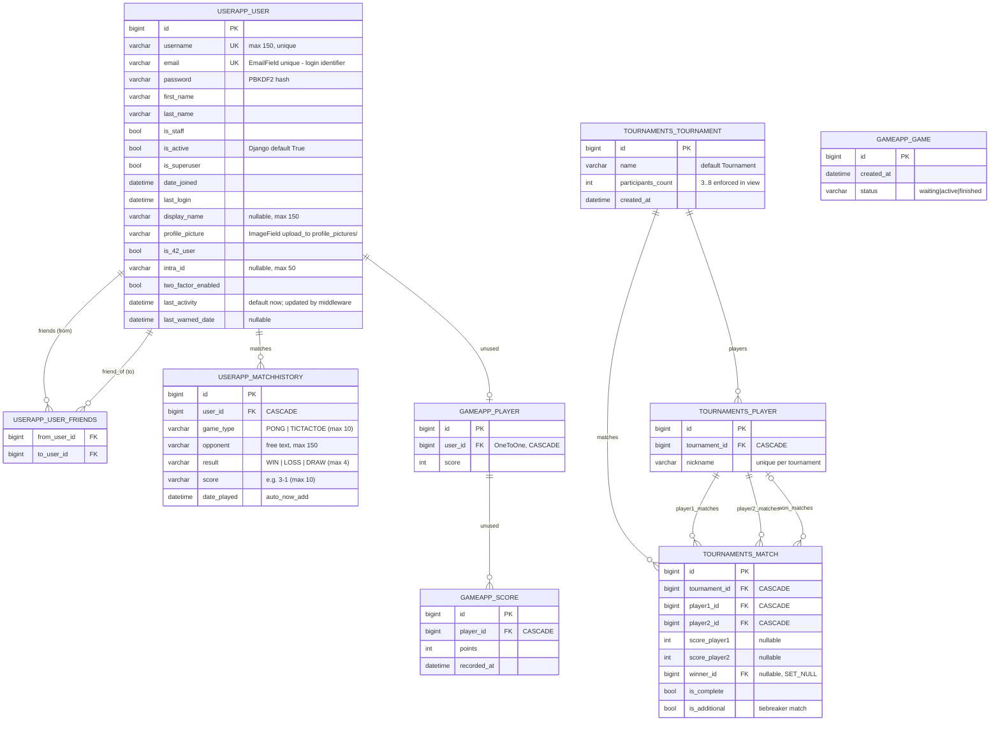

# 03 — Database schema (as migrated)

> **Why this matters at the evaluation.** "Show me your data model" and "what happens to a user's matches when they delete their account?" are standard. The schema is small; know every table, why `email` is the login identifier, and which tables exist but are unused.

## ER diagram (application tables)

## Table-by-table

### `userapp_user` (`userapp/models.py:6-63`, `db_table = 'userapp_user'`)

Extends `AbstractUser`, so it keeps `password`, `first_name`, `last_name`, `is_staff`, `is_active`, `is_superuser`, `date_joined`, `last_login`, `groups`, `user_permissions` (the last two get `related_name='custom_user_set'` to avoid clashes with `auth.User`).

| Field | Type / constraint | Who writes it |
|---|---|---|
| `username` | CharField(150), **unique** (redeclared `:19`) | register, 42 login (`login` from intra), profile PUT |
| `email` | EmailField, **unique**, `USERNAME_FIELD` | register, profile PUT |
| `display_name` | CharField(150) null | profile PUT (`display_name`) |
| `profile_picture` | ImageField → `media/profile_pictures/user_<id>.<ext>` | profile PUT with base64 data URL |
| `is_42_user`, `intra_id` | bool / CharField(50) | `get_token` on first 42 login |
| `two_factor_enabled` | bool | register checkbox only (no toggle in settings) |
| `last_activity` | DateTimeField default `timezone.now` | `UserActivityMiddleware` every ≥15 min |
| `last_warned_date` | DateTimeField null | `delete_inactive_users` when a warning email is sent |
| `friends` | M2M to self, **`symmetrical=False`**, `related_name='friend_of'` | `add_friend`/`remove_friend`; one-directional (A adding B does not make B a friend of A) |

**Why `USERNAME_FIELD = 'email'`?** The team wanted email as the login identifier (the login form asks for email). `REQUIRED_FIELDS = ['username']` keeps `createsuperuser` working. Consequence: `authenticate(username=email, password=…)` in `login_view` (`userapp/views.py:248`) — the `username` kwarg is the *USERNAME_FIELD value*, i.e. the email.

Helper methods: `get_display_name()`, `add_friend()` (no self-friend, no duplicates), `remove_friend()`, `update_last_activity()`.

### `userapp_matchhistory` (`userapp/models.py:66-90`)

One row per finished non-tournament game, written by `save_match_view`. `ordering = ['-date_played']`. `user` FK **CASCADE** → deleting the user deletes their history (the GDPR "delete" path).

`game_type` choices are `PONG`/`TICTACTOE`; `profile_view` and the frontend also filter out a `'TOURNAMENT'` value that is never actually written (tournament matches are deliberately not saved to history — `static/frontend/js/pong.js:866-867`).

### `tournaments_*` (`tournaments/models.py`)

* `Tournament.participants_count` is validated 3..8 in `create_tournament` (`tournaments/views.py:31`).
* `Player` is **not** linked to `userapp_user` — tournament participants are typed nicknames (this is why "users across tournaments" is discussed in the user-management module: the logged-in user creates the tournament; participants are local aliases).
* `Match.winner` uses `SET_NULL`; `is_additional=True` marks tiebreaker matches created by `Tournament.create_additional_matches()` for players tied on `get_score()` (= count of `Match` rows where `winner == player`).
* `unique_together = ('tournament', 'nickname')` enforces unique nicknames per tournament at the DB level (the view also rejects duplicates in the request).

### `gameapp_game` / `gameapp_player` / `gameapp_score` — present, unused

`Game`, `Player(OneToOne User)`, `Score` were an early design for server-side game state. 🆕 `gameapp` migrations `0002` created and `0003` dropped the short-lived online-TicTacToe tables (`TicTacToeQueue`/`TicTacToeMatch`) — the feature was removed at the team's request; there is no online play. No view or JS touches them. Say so if asked; do not pretend they store matches.

## Framework tables you may be asked about

| Table | From | Role here |
|---|---|---|
| `django_session` | `django.contrib.sessions` (`SESSION_ENGINE = db`, `backend/settings.py:179`) | Session created by `login()` in every login path; 24 h cookie; saved every request |
| `authtoken_token` | `rest_framework.authtoken` | One token per user, (re)created only in `verify_otp` (`userapp/views.py:327-328`) |
| **`django_cache`** 🆕 | `DatabaseCache` (`backend/settings.py:296-301`, created by `createcachetable`) | Holds `otp_<user_id>` → 6-digit code with a 600 s expiry; shared by all Gunicorn workers |
| `otp_totp_totpdevice`, `otp_static_*` | `django_otp` | Installed but unused — our 2FA is email OTP in the cache, not TOTP devices |
| `auth_group`, `auth_permission`, `django_admin_log`, `django_content_type`, `django_migrations` | Django | Standard |

Simplejwt tokens are **stateless** (signed with `SECRET_KEY`), so there is no JWT table; the `token_blacklist` app is not installed.

## Migrations worth knowing

`userapp/migrations`: `0001_initial` (custom user + `AUTH_USER_MODEL`), `0002_alter_user_is_active`, `0003/0004` display_name, `0005_matchhistory`, `0006_user_friends`, `0007_user_last_activity_user_last_warned_date` (GDPR). `tournaments/migrations`: `0001`…`0006_match_is_additional`. The entrypoint runs `makemigrations` before `migrate` at every boot, so a model edit without a committed migration still applies inside the container (but the generated file appears in the bind-mounted repo — commit it).
