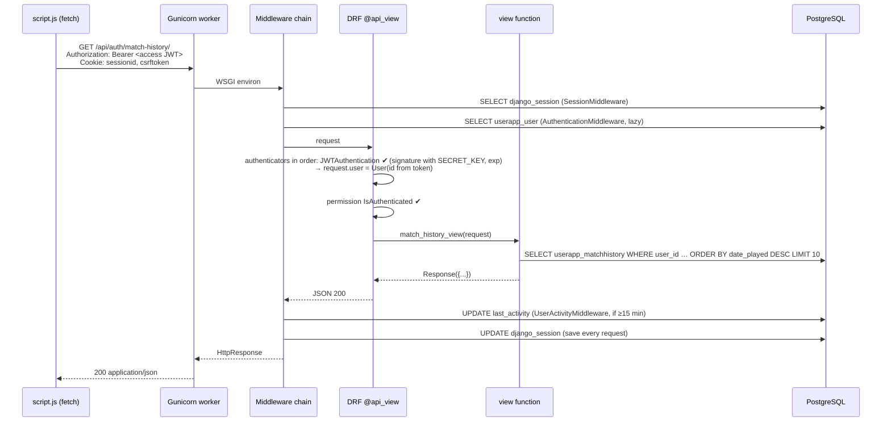

# 04 — Request lifecycle: middleware, CSRF, sessions, static files, DRF

> **Why this matters at the evaluation.** "Walk me through what happens when the browser calls your API" tests whether you understand Django rather than just wrote it. The CSRF + SPA interaction is the part people get wrong; the audit even tripped over it (403s) — use that story.

## Middleware order (`backend/settings.py:73-84`)

| # | Middleware | What it does on the way in / out |
|---|---|---|
| 1 | `SecurityMiddleware` | Security headers (HSTS etc. are off in `backend.settings`; `production_settings.py` would turn them on but is not used) |
| 2 | `whitenoise.middleware.WhiteNoiseMiddleware` | If the path is under `/static/` and exists in `staticfiles/`, serves it (gzip/brotli, far-future cache headers for hashed names) and **short-circuits** the rest |
| 3 | `SessionMiddleware` | Loads `sessionid` cookie → `django_session` row → `request.session`; on the way out saves it (`SESSION_SAVE_EVERY_REQUEST=True`) |
| 4 | `corsheaders.middleware.CorsMiddleware` | Adds CORS headers for origins in `CORS_ALLOWED_ORIGINS` (localhost:443) — practically irrelevant because the SPA is same-origin |
| 5 | `CommonMiddleware` | `APPEND_SLASH` redirects, `ALLOWED_HOSTS` check |
| 6 | `CsrfViewMiddleware` | On POST/PUT/DELETE compares the `csrftoken` cookie with the `X-CSRFToken` header (or form field) unless the view is `@csrf_exempt`; rejects with 403 |
| 7 | `AuthenticationMiddleware` | Sets `request.user` from the session (`_auth_user_id`) — this is what `SessionAuthentication` in DRF reuses |
| 8 | `MessageMiddleware`, 9 `XFrameOptionsMiddleware` | Standard (`X-Frame-Options: DENY` — the game cannot be iframed) |
| 10 | `userapp.middleware.UserActivityMiddleware` | **After** the view: if `request.user.is_authenticated` and `last_activity` older than 15 min → `update_last_activity()` (one UPDATE per user per 15 min). Note: JWT-only requests do **not** count as activity, because `request.user` here comes from the session, not from DRF |

## Sequence: a generic authenticated API call from the SPA

For `profile_view` the DRF step differs: only `TokenAuthentication` and `SessionAuthentication` are tried (`userapp/views.py:75`), so the request is authenticated by the **session cookie**; `SessionAuthentication` then also enforces CSRF on PUT.

## CSRF — how the SPA satisfies it

1. `index.html` contains `` (`templates/frontend/index.html:17`), and `CSRF_COOKIE_HTTPONLY=False` (`backend/settings.py:213`), so the `csrftoken` cookie is readable by JS.
2. `getCookie('csrftoken')` (`static/frontend/js/script.js:180`) reads it and every unsafe `fetch` sends `X-CSRFToken`.
3. Registration first does `GET /api/auth/register/` (`script.js:419`) — the view is `@ensure_csrf_cookie`, guaranteeing the cookie exists before the POST.
4. **Rotation:** Django rotates the CSRF token on `login()` (and `register_view` logs the user in). The browser automatically has the new cookie; a scripted client that cached the old header value gets **403 "CSRF token … incorrect"** — exactly what the audit's curl script hit until it re-read the cookie before each call. If someone asks "why did your curl fail", that is the answer.
5. Views that are `@csrf_exempt`: `redirect_uri`, `oauth_callback`, `get_token`, `save_match_view`, `create_match` — for the OAuth ones because the redirect comes from 42; for the game ones because the token-authenticated fetches were failing CSRF during development.
6. `CSRF_TRUSTED_ORIGINS`/`CORS_ALLOWED_ORIGINS` include `https://localhost:443` (`backend/settings.py:215-268`, incl. the `.extend()` calls).

## Sessions

* DB-backed (`SESSION_ENGINE = 'django.contrib.sessions.backends.db'`), cookie `sessionid`, 24 h, `HttpOnly`, `SameSite=Lax`, **`SESSION_COOKIE_SECURE=False`** (`backend/settings.py:179-186`) — flagged in the audit as a low-severity hardening item since the site is HTTPS-only.
* Created in `login_view`, `verify_otp`, `register_view`, `get_token`, `oauth_callback` via `login(request, user)`; cleared by `logout_view`.
* Because `SESSION_SAVE_EVERY_REQUEST=True`, every request that carries a cookie writes to `django_session`.

## Static files — why `collectstatic` is mandatory

`STATICFILES_STORAGE = 'whitenoise.storage.CompressedManifestStaticFilesStorage'` (`backend/settings.py:311`). `` is resolved through `staticfiles/staticfiles.json` to a **hashed** name such as `frontend/js/script.6bab85a1e524.js`, which must exist in `staticfiles/`. Editing `static/frontend/js/script.js` changes nothing served until `collectstatic` runs. During the audit the served `script.js` was **one commit behind** `static/` for this reason.

**🆕 Changed in Aug-2026 audit:** `scripts/entrypoint.sh:52` runs `collectstatic --noinput` at every start (it was commented out), and `staticfiles/` was regenerated and committed. WhiteNoise serves from `staticfiles/` with immutable cache headers for hashed names, so browsers never see stale JS after a deploy.

Media files (avatars) are **not** served by WhiteNoise nor by `static(MEDIA_URL…)` (no-op when `DEBUG=False`); the SPA rewrites `/media/profile_pictures/…` URLs to `/api/auth/avatar/<id>/` (`script.js:1508-1534`), a view that streams the file with `FileResponse`.

## DRF defaults (`backend/settings.py:56-63`)

`DEFAULT_AUTHENTICATION_CLASSES = [JWTAuthentication, TokenAuthentication, SessionAuthentication, BasicAuthentication]` — tried in order; first that returns a user wins. No default permission class is set, so views must add `@permission_classes([IsAuthenticated])` (all data views do; `get_avatar_image` and `debug_avatar_path` intentionally/accidentally do not).

## Error-handling patterns you will see in the code

* Most views wrap everything in `try/except Exception as e` and return `{"status": "error", "message": str(e)}` with 400/500 — simple, but it leaks exception text to the client (noted in the audit).
* Extensive `print()` debugging (request headers, request bodies, tokens) goes to `gunicorn-error.log`. The register view prints incoming headers including cookies — a privacy point in the audit.
* Frontend surfaces errors with `alert()`.
* **🆕** OTP email failures are now caught in the sending thread and logged via `logger.exception` (`userapp/views.py:65-66`) instead of turning the login request into a 500.

## Timeline of one page load (for "how does SSR fit in")

1. `GET /profile` → catch-all → `gameapp.views.index` renders `templates/frontend/index.html` **server-side** (Django template engine substitutes `` hashed URLs and ``) → full HTML with every page `
` present but hidden.
2. Browser loads CSS/JS (WhiteNoise + CDNs). `script.js` runs; on `load`, `showPage('profile')` (`script.js:132-152`) unhides `#profile`, and `loadProfileData()` fetches `/api/auth/profile/`.
3. All later navigation is client-side (`history.pushState`), no further HTML from the server.
