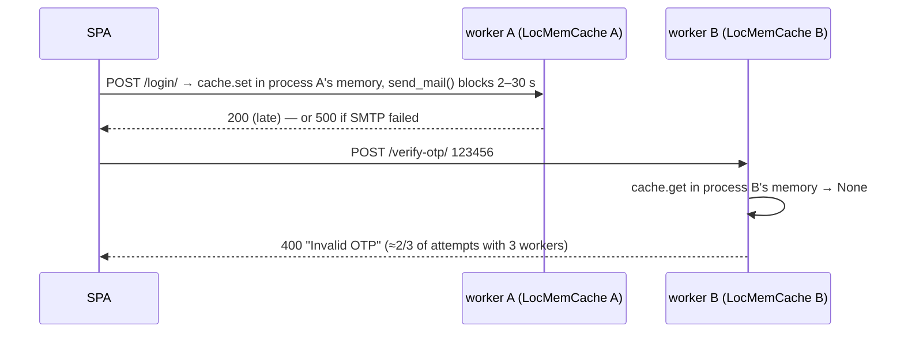

# 05 — Sequence diagrams for the critical flows

> **Why this matters at the evaluation.** Staff will pick a feature and say "show me, then explain what happened underneath". Each diagram below is the underneath. Line references point at the exact code so you can open it live.

## (a) Standard login + token issuance

```mermaid
sequenceDiagram
    actor U as User
    participant SPA as script.js handleLogin (:256)
    participant API as POST /api/auth/login/ login_view (views.py:239)
    participant DJ as django.contrib.auth
    participant JWT as simplejwt RefreshToken
    participant DB as PostgreSQL

    U->>SPA: email + password, Sign In
    SPA->>API: JSON {email, password} + X-CSRFToken
    API->>DJ: authenticate(username=email, password) (:248)
    DJ->>DB: SELECT user WHERE email=…; check PBKDF2 hash
    DJ-->>API: user or None
    alt invalid
        API-->>SPA: 400 "Invalid email or password."
    else two_factor_enabled
        Note over API: → see diagram (c)
    else no 2FA
        API->>DJ: login(request, user) (:272)  → django_session row + sessionid cookie
        API->>JWT: RefreshToken.for_user(user) (:275)
        API-->>SPA: 200 {access_token, refresh_token, requires_2fa:false, user{id,email,username,profile_picture}}
        SPA->>SPA: localStorage: isLoggedIn=true, userData, authToken, refreshToken (:291-294)
        SPA->>SPA: checkLoginState(); showPage('home')
    end
```

Token lifetimes: access 60 min, refresh 7 days (`backend/settings.py:65-71`). The frontend decodes `exp` from the access token to decide when to refresh (`script.js:1403-1472`).

## (b) 42 OAuth (authorization-code flow) — *Remote authentication* Major module

```mermaid
sequenceDiagram
    actor U as User
    participant SPA as script.js
    participant API as userapp.views
    participant I as api.intra.42.fr
    participant DB as PostgreSQL

    U->>SPA: click "Sign in with 42" (initiate42OAuth :975)
    SPA->>API: POST /api/auth/redirect_uri/ (redirect_uri :481, csrf_exempt)
    API-->>SPA: {oauth_link: https://api.intra.42.fr/oauth/authorize?client_id=FORTYTWO_CLIENT_ID&redirect_uri=https://localhost/oauth/callback&response_type=code}
    SPA->>I: window.location = oauth_link (:1007)
    U->>I: log in at 42, consent
    I-->>SPA: 302 https://localhost/oauth/callback?code=XYZ
    SPA->>API: GET /oauth/callback?code=XYZ → catch-all → index.html
    SPA->>SPA: showPage('oauth/callback') (:25-40) → checkOAuthLogin() (:1018)
    SPA->>SPA: history.replaceState to strip ?code (:1033)
    SPA->>API: POST /api/auth/get-token/ {code} (get_token :586, csrf_exempt)
    API->>I: POST /oauth/token grant_type=authorization_code, code, client_id, client_secret, redirect_uri (:601-613)
    I-->>API: {access_token}
    API->>I: GET /v2/me Bearer access_token (:621-623)
    I-->>API: {id, login, email, …}
    API->>DB: User.get_or_create(email=…, defaults{username=login, is_42_user, intra_id}) (:639-642)
    API->>API: login(request, user) (:650); RefreshToken.for_user
    API-->>SPA: 200 {access_token, refresh_token, user}
    SPA->>SPA: localStorage tokens + isLoggedIn (:1055-1068); scheduleTokenRefresh()
    SPA->>SPA: setTimeout → window.location.href='/' (:1077)
```

Notes: no `state` parameter is sent/verified (CSRF protection on the OAuth callback is absent — audit limitation; `OAUTH_STATE_SECRET` exists in `.env` but is unused). The **registered redirect URI in the 42 app must be exactly `https://localhost/oauth/callback`**. `oauth_callback` (`views.py:515`) is an older server-side variant that is never reached. The 42 client key expired in 2026; the code path is verified up to the authorize URL; final verification needs the rotated key in `.env` (`FORTYTWO_CLIENT_ID/SECRET`).

## (c) 2FA login — **🆕 post-fix behaviour**

```mermaid
sequenceDiagram
    actor U as User
    participant SPA as script.js
    participant W1 as Gunicorn worker A
    participant W2 as Gunicorn worker B
    participant C as django_cache table (DatabaseCache)
    participant T as daemon thread
    participant M as Gmail SMTP (or console backend)

    U->>SPA: Sign In
    SPA->>W1: POST /api/auth/login/
    W1->>W1: authenticate ✔, user.two_factor_enabled
    W1->>C: cache.get("otp_<id>") (:258)
    alt no live code
        W1->>W1: otp = random 6 digits (:260)
        W1->>C: cache.set("otp_<id>", otp, timeout=OTP_TTL_SECONDS=600) (:261)
    else code still valid (user clicked twice)
        Note over W1,C: reuse the same code → first email stays valid
    end
    W1->>T: send_otp_email_async(user, otp) (:263 → :46-70) — thread.start(), returns immediately
    W1-->>SPA: 200 {requires_2fa:true, "Please check your email for OTP"} (~80 ms)
    T->>M: send_mail(…"Your OTP for login is: 123456 / Valid for 10 minutes") with EMAIL_TIMEOUT=10
    M-->>T: ok / error → logger.exception (never a 500 for the user)
    SPA->>SPA: localStorage temp_email; show #otp-modal (:277-288)
    U->>SPA: types code, Verify
    SPA->>W2: POST /api/auth/verify-otp/ {email, otp} (handleOTPVerification :310)
    W2->>W2: otp = str(otp).strip() (:298); user by email
    W2->>C: cache.get("otp_<id>") (:319)  ← shared table, so worker B sees worker A's code
    alt str(cached) == otp
        W2->>W2: login(request,user); Token recreated (:324-328); RefreshToken.for_user
        W2->>C: cache.delete (:332) — single use
        W2-->>SPA: 200 {access_token, refresh_token, user}
        SPA->>SPA: localStorage tokens; hide modal; showPage('home')
    else
        W2-->>SPA: 400 "Invalid OTP"
    end
```

**Before the fix (why "a correct code was sometimes rejected"):**



Additional pre-fix causes: a second click on Sign In generated a *new* code, so the first email became stale; TTL was 5 min while email delivery was slow; comparison was exact (`cached_otp == otp`) with no trimming. Regression tests: `userapp/tests.py` `TwoFactorLoginTests`.

## (d) Game → match history (Pong; AI opponent; TicTacToe as an extra feature)

```mermaid
sequenceDiagram
    actor U as User
    participant SPA as script.js
    participant P as pong.js PongGame
    participant API as userapp.views
    participant DB as PostgreSQL

    U->>SPA: PLAY NOW (checkAuthAndRedirect :893 → showPage('game') :916)
    SPA->>SPA: initializeGameIfNeeded('game') (:199) → PongGame.initializeGame(container, null) (pong.js:1123)
    P-->>U: mode selection: Player vs Player / Player vs AI
    U->>P: choose → PongGame.startGame(container, mode) (:1175) → new PongGame
    P->>P: GameRenderer (Three.js scene), GamePhysics, InputHandler, PongAI if 'ai'
    loop requestAnimationFrame (animate :1111)
        P->>P: inputHandler.update(); ai.update(); physics.updatePhysics → scorer?
        P->>P: updateScore (:1025); pointsToWin = 3 (GAME_CONFIG :9)
    end
    P->>P: finishMatch() (:826) — not a tournament → saveMatchHistory() (:886)
    P->>API: POST /api/auth/save-match/ Bearer JWT {game_type:'PONG', opponent:'AI'|'Player 2', result, score '3-1'} (:925)
    API->>DB: INSERT userapp_matchhistory (save_match_view views.py:775)
    API-->>P: 201 {"status":"success"}
    P-->>U: Restart button
    U->>SPA: Profile → loadProfileData (:1089) → GET /api/auth/profile/ (session auth)
    API->>DB: last 5 matches, count, wins, best score (profile_view :76-142)
    API-->>SPA: stats + match_history → cards + SVG pie chart (createWinratePieChart :1947)
```

**TicTacToe (bonus feature, not a claimed module)** differs only at the edges: `new TicTacToeGame(container)` (`script.js:221`) → constructor calls `initializeMatch()` → `POST /api/auth/match/create/` (`tictactoe.js:138`, returns a UUID `match_id` from `create_match views.py:826`); on win/draw `finishMatch()` (`tictactoe.js:192`) posts `game_type:'TICTACTOE', opponent:'Player 2', score '1-0'|'0-1'|'0-0'` to `/api/auth/save-match/` (`:222`). (`updateMatchState` posts to `/api/game/match/<id>/state`, a URL that does not exist — the failure is caught and ignored.)

**Game modes / the AI opponent (AI-Algo Major module).** The mode screen offers *Player vs Player* (two people on one keyboard: W/S vs ↑/↓) or *Player vs AI*. In AI mode `PongAI` (`pong.js:585-676`) controls the right paddle: it samples the ball **once per second** (`UPDATE_INTERVAL = 1000`), extrapolates the intercept point with a deliberate prediction error and a 10 % "mistake" chance, and then moves the paddle towards that target frame by frame at a capped speed — i.e. it simulates key presses between observations rather than tracking the ball perfectly (see `SPA-routing-and-frontend.md` → *The AI opponent*). There is no online play, queue or WebSocket; say this plainly if asked about "remote players" (not a selected module).

## (e) Tournament flow

```mermaid
sequenceDiagram
    actor U as User
    participant SPA as script.js
    participant P as pong.js
    participant T as tournaments.views
    participant DB as PostgreSQL

    U->>SPA: TOURNAMENT → showPage('tournament') → sub-section create-tournament
    U->>SPA: participants_count 3..8 → handleTournamentCreation (:1394)
    SPA->>T: POST /tournaments/api/tournaments/create/ {participants_count} (create_tournament :22)
    T->>DB: INSERT tournament
    T-->>SPA: {tournament_id} → generatePlayerInputs (:2062), show add-players
    U->>SPA: nicknames → handleAddPlayers (:2087)
    SPA->>T: POST …/<id>/add_players/ {nicknames[]} (add_players :41)
    T->>DB: INSERT players; INSERT Match for every combinations(players,2)
    T-->>SPA: {success:true} → loadTournamentData (:2159)
    SPA->>T: GET …/<id>/ (view_tournament :74) — calls tournament.get_winner() (models.py:18)
    T-->>SPA: {tournament{status,winner_ids}, players[{score}], matches[]} → tables
    U->>SPA: Start Match → startTournamentMatch(matchId) (:481)
    SPA->>T: POST …/match/<id>/start/ (start_match :120)
    T-->>SPA: {player1, player2, tournament_id} → window.currentMatchId/currentMatchPlayers → showPage('game')
    SPA->>P: PongGame.initializeGame(container,'pvp') with currentMatchId (names shown from currentMatchPlayers)
    P->>P: play to 3 → finishMatch (:826) tournamentId set
    P->>T: POST /tournaments/api/tournaments/<matchId>/finish/ {score_player1, score_player2} (:846 → finish_match :165)
    T->>DB: UPDATE match scores, winner, is_complete
    P-->>U: NEXT GAME → window.showPage('tournament') (:969-990)
    SPA->>T: GET …/<id>/ → get_winner(): all regular matches complete?
    alt single top score
        T-->>SPA: winner_ids=[id], status Complete → winner section
    else tie
        T->>DB: create_additional_matches(tied) → round-robin is_additional=True (models.py:67)
        T-->>SPA: tiebreaker table shown (#additional-matches)
    end
```

Note: tournament results are intentionally **not** written to `MatchHistory` (`pong.js:866-867`), so tournaments do not distort personal statistics. The whole tournament runs on one machine; nicknames are aliases, not accounts.

## (f) GDPR flows

```mermaid
sequenceDiagram
    actor U as User
    participant SPA as script.js (Settings page)
    participant API as userapp.views
    participant DB as PostgreSQL

    rect rgb(235,245,255)
    Note over U,DB: Export ("Download My Data")
    U->>SPA: click → handleDownloadUserData (:1515)
    SPA->>API: GET /api/auth/export-data/ Bearer (export_user_data :932)
    API->>DB: user fields + all MatchHistory + stats
    API-->>SPA: JSON; SPA also fetches /api/auth/avatar/<id>/ and embeds it as base64, then triggers a .json download
    end

    rect rgb(255,240,240)
    Note over U,DB: Delete ("Delete My Account")
    U->>SPA: confirm → deleteAccount (:795)
    SPA->>API: DELETE /api/auth/delete-account/ Bearer (delete_account :851)
    API->>DB: user.delete() → CASCADE MatchHistory, friends rows, authtoken; session row orphaned until expiry
    API-->>SPA: 200 → clear localStorage → /login
    end
```

**Inactivity cleanup** (`userapp/management/commands/delete_inactive_users.py`): `last_activity` is maintained by `UserActivityMiddleware`; the command computes `warning_threshold = now − 150 days` and `inactive_threshold = now − 180 days` (`:36-37`); users between the two get a warning email once per 30 days (`last_warned_date`, `:57`); users past 180 days get a deletion email and `user.delete()`; staff/superusers are excluded. `--dry-run` prints only; `--notify-only` skips deletion. Scheduled weekly by `gdpr_cleanup_crontab` *on a host cron* — the container has no cron; 🆕 `make gdpr-cleanup` / `make gdpr-cleanup-run` run it. Tested in `GdprTests.test_inactive_user_cleanup_command`.
